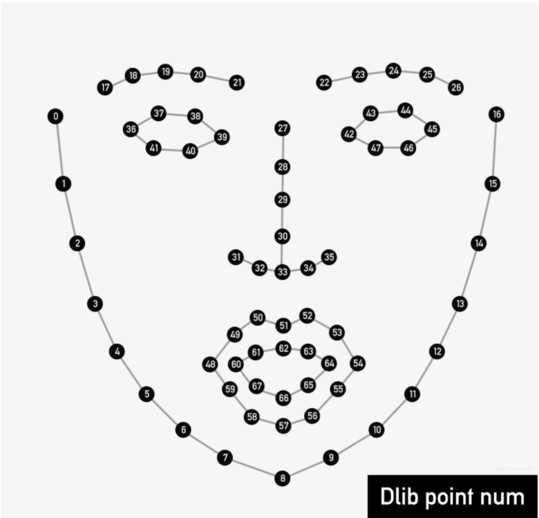

# Project概要
- OpenCV・Pythonの練習と今後の心理学研究での視線分析の必要を兼ねて、OpenCVで視線追跡することを目指す

# スケジュール
- 1月中に目の位置をアプリで表示する

# 参考文献
- 松田君の記事を参考とする　https://www.remma.net/?p=37

# 手順
## 環境作成
### OpenCVのインストール
- pythonのOpencvを下記コマンドをコマンドプロンプトから入力してインストールする<br>"pip install opencv–python"
- Pythonの対話型実行環境を実行してOpenCVのライブラリcv2が利用できるかをチェック

- 対話型実行環境が起動されると「>>>」とプロンプトが表示されるので"import cv2"と入力。エラーが出なければinstallできている。
### dlibのインストール
dlibとはC++の機械学習・画像解析用ライブラリ
- dlibのinstallにはCMakeのインストールが必要
- Cmakeのインストール→ https://qiita.com/East_san/items/b8ebc34dad226865899a
- dlibのインストール→ https://qiita.com/Kurobani/items/fd84fd941f527c46ab98

## 学習済みモデルのダウンロード
 - 顔器官の取得に学習が必要なため、学習済みのモデルをダウンロードする
 　http://dlib.net/files/shape_predictor_68_face_landmarks.dat.bz2
 - 学習済みモデルはプログラムと同じ階層に置く。

 ## 下記ページを参考に顔器官の表示を行ってみる
 - https://cppx.hatenablog.com/entry/2017/12/25/231121
 ### 嵌ったポイント
 - 検出器の読み込みを相対パスで行うと、ファイルが読み込めない下記エラーが出たので絶対パスにした。ところうまくいった
  RuntimeError: Unable to open shape_predictor_68_face_landmarks.dat
 
 ```
path = '/Users/GakutoSasabe/Desktop/Research/OpencvEyetracking/shape_predictor_68_face_landmarks.dat'
predictor = dlib.shape_predictor(path)
```
## 瞳座標の取得
目の部分から黒い部分を抜き出してその重心を瞳にする
### dlibの座標の順番

